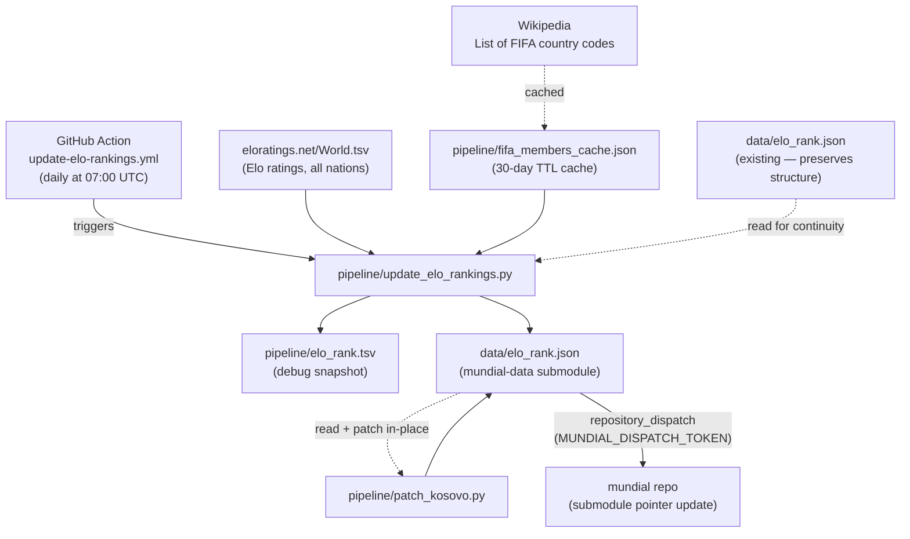

# elo_rank.json — build pipeline

**Update cadence: daily, automated via GitHub Actions (`update-elo-rankings.yml`).**

## GitHub Action details

The workflow (`.github/workflows/update-elo-rankings.yml`) runs every day at **07:00 UTC**
and can also be triggered manually via `workflow_dispatch`.

It:
1. Runs `pipeline/update_elo_rankings.py` (which calls `patch_kosovo.py` at the end)
2. Commits `data/elo_rank.json` directly to the `mundial-data` submodule repo
3. Commits `pipeline/elo_rank.tsv` and `pipeline/fifa_members_cache.json` to this repo
4. Fires a `repository_dispatch` event to the `mundial` frontend repo so it pulls the
   updated submodule pointer automatically

## Notes

`patch_kosovo.py` is called automatically at the end of `update_elo_rankings.py`
because eloratings.net does not include Kosovo — and since the file is rewritten from
scratch on each run, Kosovo must be re-injected every time. See `patch_kosovo.md`.

`patch_kosovo.py` also patches `pipeline/countries.json` (adding Kosovo's metadata),
but that side-effect is only relevant when rebuilding `map_data.json` — see `map_data.md`.
