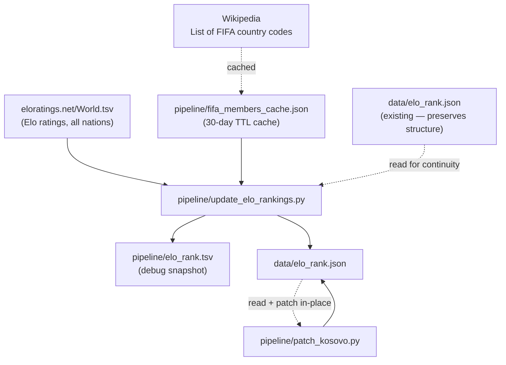

# elo_rank.json — build pipeline

`patch_kosovo.py` is called automatically at the end of `update_elo_rankings.py`.
Kosovo (XK) has no standard ISO entry and is injected manually with `rank=null, pts=null`.
