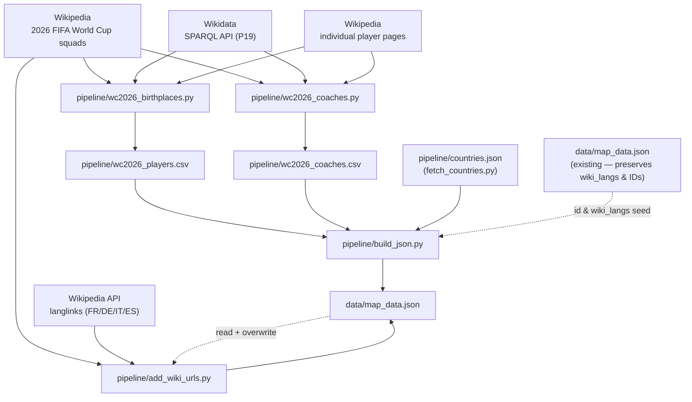

# map_data.json — build pipeline

```mermaid
flowchart TD
    WP["Wikipedia\n2026 FIFA World Cup squads"]
    WD["Wikidata\nSPARQL API (P19)"]
    WPP["Wikipedia\nindividual player pages"]
    WPA["Wikipedia API\nlanglinks (FR/DE/IT/ES)"]
    CJ["pipeline/countries.json\n(fetch_countries.py)"]
    EJ["data/map_data.json\n(existing — preserves wiki_langs & IDs)"]

    BP["pipeline/wc2026_birthplaces.py"]
    CP["pipeline/wc2026_coaches.py"]
    BJ["pipeline/build_json.py"]
    WU["pipeline/add_wiki_urls.py"]

    PC["pipeline/wc2026_players.csv"]
    CC["pipeline/wc2026_coaches.csv"]

    OUT["data/map_data.json"]

    WP --> BP
    WD --> BP
    WPP --> BP
    BP --> PC

    WP --> CP
    WD --> CP
    WPP --> CP
    CP --> CC

    PC --> BJ
    CC --> BJ
    CJ --> BJ
    EJ -.->|id & wiki_langs seed| BJ
    BJ --> OUT

    WP --> WU
    WPA --> WU
    OUT -.->|read + overwrite| WU
    WU --> OUT
```
