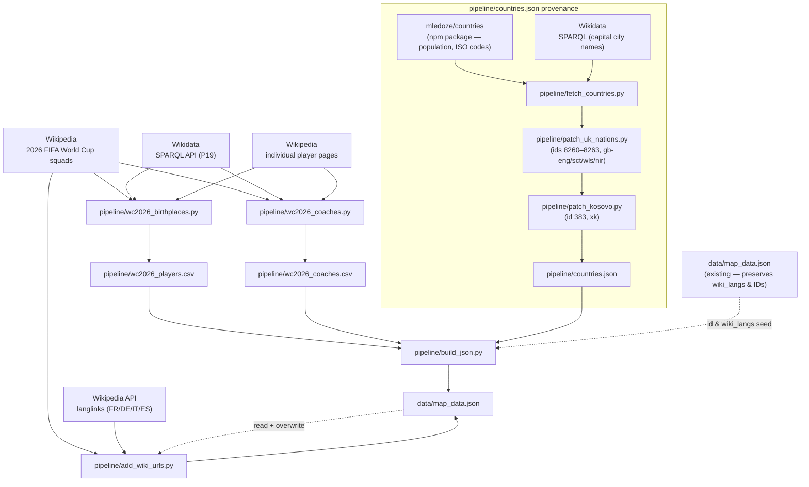

# map_data.json — build pipeline

**Update cadence: manual, as needed. No scheduled job. Regular refreshes are welcome
but not required** — the squad data and birthplace enrichment are stable for the
duration of WC 2026.

