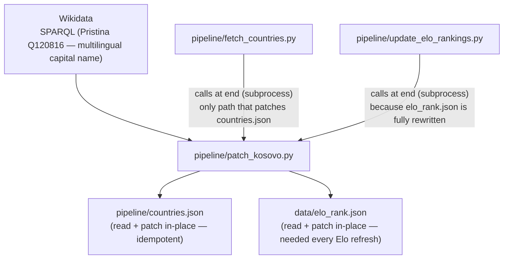

# patch_kosovo.py — what it does and when it runs

## What it patches

`patch_kosovo.py` injects Kosovo into **two independent files** for two independent reasons:

### 1. `pipeline/countries.json` — run once, idempotent

Kosovo (id=383, alpha2=`xk`) is absent from the mledoze/countries dataset that
`fetch_countries.py` uses as its source. Without this patch, `build_json.py` cannot
resolve Kosovo's numeric map ID or population, and Kosovo would render as non-interactive
on the frontend map.

The script fetches the multilingual name of the capital (Pristina) live from Wikidata
(Q120816), then inserts the full Kosovo entry into `countries.json`. If Kosovo is already
present it skips silently — so re-running is always safe.

**When it runs:** automatically at the end of `fetch_countries.py`. Never needs to be
re-run unless `countries.json` is regenerated from scratch.

### 2. `data/elo_rank.json` — re-applied on every Elo refresh

`update_elo_rankings.py` rewrites `elo_rank.json` completely from
[eloratings.net/World.tsv](https://www.eloratings.net/World.tsv), which does not
include Kosovo. This means Kosovo disappears from `elo_rank.json` on every Elo refresh
and must be re-injected each time.

`patch_kosovo.py` appends Kosovo with `rank=null, pts=null` so the frontend can still
render it on the map even without an Elo score.

**When it runs:** automatically at the end of `update_elo_rankings.py`, every time Elo
rankings are refreshed.

---

## Is there a risk of `countries.json` being read before Kosovo is patched?

No — in normal use. `build_json.py` (the only consumer of `countries.json`) is a
separate manual step. By the time anyone runs `build_json.py`, `fetch_countries.py`
has already completed — and `patch_kosovo.py` is called synchronously at the end of
`fetch_countries.py`, before it returns. So `countries.json` is always fully patched
before `build_json.py` reads it.

---

## Call graph

---

## Summary: one script, two independent motivations

| File patched | Why | How often |
|---|---|---|
| `pipeline/countries.json` | Kosovo missing from mledoze source | Once — idempotent, skipped if already present |
| `data/elo_rank.json` | eloratings.net doesn't include Kosovo; file is rewritten from scratch on each Elo refresh | Every time `update_elo_rankings.py` runs |
