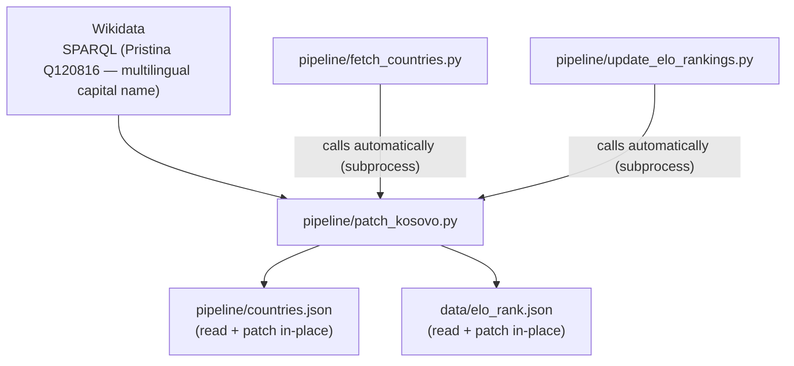

# patch_kosovo.py — what it does and when it runs

Kosovo (id=383, alpha2=`xk`) is absent from standard ISO 3166-1 tables, so it must
be injected explicitly into both files:

- **`countries.json`** — adds Kosovo with population, and multilingual capital name
  (Pristina) fetched live from Wikidata. Skipped if Kosovo is already present.
- **`elo_rank.json`** — appends Kosovo with `rank=null, pts=null` so the frontend
  can render it on the map even without an Elo score.

The script is idempotent and can be run standalone, but in normal use it is triggered
automatically at the end of both `fetch_countries.py` and `update_elo_rankings.py`.
