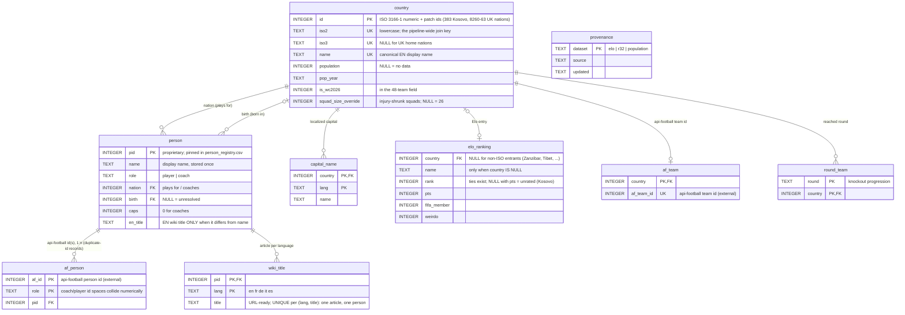

# Data pipeline

Scripts and source data for the Mundial 2026 choropleth map and live-match page.

All scripts resolve paths relative to `__file__`, so `python3 pipeline/foo.py`
and `cd pipeline && python3 foo.py` are equivalent.

Output that the `mundial` frontend actually fetches lives in the `data/`
submodule (see `../CLAUDE.md` for the commit workflow — data changes commit
in the submodule first, then the pointer is bumped here). `extras/` scripts
(GDP/HDI/Elo history, feeding only the standalone `pages/` charts) are
documented in `../CLAUDE.md`, not here.

---

## Prerequisites

```bash
pip install requests beautifulsoup4 pandas lxml pycountry jellyfish
```

---

## Script index

| Script | Output | Notes |
|--------|--------|-------|
| `fetch_countries.py` | `countries.json` | Population + multilingual capital from mledoze + World Bank + Wikidata. Auto-runs `patch_uk_nations.py` + `patch_kosovo.py` at the end. |
| `patch_uk_nations.py` | `countries.json` (in-place) | Adds UK home nations (ids 8260–8263) |
| `patch_kosovo.py` | `countries.json`, `data/elo_rank.json` (in-place) | Adds Kosovo (id 383) |
| `country_registry.py` | _(module, no output)_ | Canonical country-identity resolver — see below. Run directly (`python3 pipeline/country_registry.py`) for a self-test. |
| `wc2026_birthplaces.py` | `wc2026_players.csv` | Scraper: Wikipedia squad page + Wikidata birth lookup |
| `wc2026_coaches.py` | `wc2026_coaches.csv` | Scraper: coaches from Wikipedia squad page + Wikidata birth lookup |
| `build_json.py` | `data/map_data.json` | Rebuilds the main data file from the CSVs + `countries.json` |
| `add_wiki_urls.py` | `data/map_data.json` (in-place) + `data/wiki_<lang>.json` ×5 | Resolves Wikipedia identity (players + coaches) — see "Wiki data" below |
| `validate_country_coverage.py` | _(stdout, exit code)_ | Coverage gate — run after the pipeline, before committing |
| `fetch_r32_teams.py` | `data/r32_teams.json` | Round-of-32 teams from api-football, resolved through `country_registry.py` |
| `build_player_wiki.py` | `data/player_wiki.json`, `player_aliases_manual.json` | Player/coach identity resolver — see "Player identity" below |
| `update_elo_rankings.py` | `data/elo_rank.json` | Fetches current Elo ratings from eloratings.net |
| `load.py` | `mundial.db` (gitignored), `person_registry.csv` | Phase 1 of the relational build — see "Relational model" below |
| `export.py` | `data/v2/` (7 files) | Phase 2 — exports pid-keyed view files from `mundial.db` |

---

## Relational model (`schema.sql` → `mundial.db` → `data/v2/`)

The normalized canonical model of the whole dataset. Runs **after** the
existing scripts, reading their outputs as-is — nothing upstream changes:

```bash
python3 pipeline/load.py     # inputs -> pipeline/mundial.db (rebuildable, gitignored)
python3 pipeline/export.py   # mundial.db -> data/v2/{map,live,wiki_<lang>}.json, atomically
```

`schema.sql` holds the entities with real FK/UNIQUE constraints — data
inconsistencies fail the load instead of shipping — plus the `view_*`
views that `export.py` serializes.



Facts the schema encodes that the JSON files never enforced: api-football coach and player ids are separate id
spaces that collide numerically; one person can hold several api-football
ids (duplicate-id records); Elo ranks have ties; a Wikipedia article
belongs to exactly one person.

Every person gets a **`pid`** — a small integer that replaces the
`wikiTitle` string as the cross-file join key in the `data/v2/` files
(`map.json` mirrors `map_data.json` with `pid` instead of `wikiTitle`;
`live.json` maps `iso2 → af_id → {pid, birthCountry}`; each
`wiki_<lang>.json` holds a `titles` array indexed by pid). Roughly 44%
smaller live-page payload gzipped. pids are pinned forever in
`person_registry.csv` (committed): matched by `(role, api-football id)`
first, then `(nation iso2, name)`; new persons append, pids are never
reused. All 7 exports are written together from one DB state, so pids
can't disagree across files.

The old-format files stay untouched (they're `load.py`'s inputs and what
the current frontend reads) until the `mundial` frontend migrates to pid
lookups.

Known tolerated defect: two persons currently share the EN title
"Emiliano Martínez" (Argentina's keeper owns the article; Uruguay's
Emiliano Martínez is mislinked in the source data). `load.py` warns and
ships the later pid without a wiki link until the matcher/aliases are
fixed. `export.py`'s `live.json` also corrects his `birthCountry` to
Uruguay (map_data is right, `player_wiki.json` scraped it from the wrong
article).

---

## Core pipeline (squad + country data)

```bash
# Countries (run when rebuilding from scratch)
python3 pipeline/fetch_countries.py      # → countries.json (patches run automatically)

# Squad data
python3 pipeline/wc2026_birthplaces.py   # → wc2026_players.csv
python3 pipeline/wc2026_coaches.py       # → wc2026_coaches.csv
python3 pipeline/build_json.py           # → data/map_data.json

# Enrich Wikipedia identity (slow, ~5 min — one API call per language per batch of 50 titles)
python3 pipeline/add_wiki_urls.py        # → data/map_data.json (in-place) + data/wiki_<lang>.json

# Coverage gate — run after the pipeline, before committing.
python3 pipeline/validate_country_coverage.py

# Elo ratings + Round of 32 teams
python3 pipeline/update_elo_rankings.py  # → data/elo_rank.json (re-patches Kosovo automatically)
python3 pipeline/fetch_r32_teams.py --key YOUR_API_FOOTBALL_KEY   # → data/r32_teams.json

# Player/coach identity for the live-match page (needs API_FOOTBALL_KEY)
python3 pipeline/build_player_wiki.py    # → data/player_wiki.json
```

`fetch_r32_teams.py` and `build_player_wiki.py` both need an api-football key —
set `API_FOOTBALL_KEY` in `.env` (auto-loaded) or pass `--key`.

---

## Country identity (iso2 is the join key)

The same country shows up under different free-text spellings across upstream
sources (Wikipedia, Wikidata, eloratings.net, api-football, World Bank, …) —
e.g. DR Congo alone appears as `"DR Congo"`, `"Congo, The Democratic Republic
of the"`, and `"Congo DR"` depending on the source. `country_registry.py` is
the single place that resolves a raw name to a canonical lowercase iso2
(`resolve_iso2()`), and the single place output scripts get a display name
from (`canonical_name()` / `display_name()`). Its data lives in
`country_aliases.json` (known spelling variants, keyed by iso2, plus the
current 48-team WC2026 field).

An unrecognized name raises `UnknownCountryError` instead of silently falling
through to a heuristic — add the missing spelling to `country_aliases.json`
rather than adding another local override dict. `build_json.py`,
`update_elo_rankings.py`, `fetch_r32_teams.py`, `wc2026_birthplaces.py`, and
`wc2026_coaches.py` all resolve through this module. `extras/` scripts
(GDP/HDI/elo_history) still use their own independent name maps — not yet
migrated.

Run `python3 pipeline/validate_country_coverage.py` after the pipeline: it
resolves every raw country string currently in the CSVs and in
`map_data.json`/`elo_rank.json`/`r32_teams.json`, and checks every current
WC2026 nation actually has rows in both CSVs. A new upstream spelling variant
shows up here as a failed build, not a silent wrong-flag bug weeks later.

---

## Player/coach identity (`build_player_wiki.py`)

Same root problem as country identity, one level down: a player's name from
Wikipedia (`wc2026_players.csv`/`wc2026_coaches.csv`) often doesn't match the
name api-football renders for the same person in live lineup data —
abbreviated initials ("L. Martinez"), transliteration variants, dropped
middle names, stage names (Bono = Yassine Bounou), even different names for
the same api-football id across different fixtures. `build_player_wiki.py`
resolves this once, at build time, for everyone who's appeared in a finished
WC2026 fixture, via a 7-tier rule-based matcher (`norm` → `initials+tail` →
`prefix` → `middle-optional` → `phonetic` → `mononym` → `soundex`, in that
order of confidence) plus `player_aliases_confirmed.json` (hand-verified
pairs the matcher can't resolve on its own, keyed by api-football's numeric
id so a future name-string change for the same person doesn't break it).

Exports `data/player_wiki.json`, keyed by iso2 then by api-football's numeric
player/coach id — **id, not name**, since api-football has been observed to
render the same person differently across fixtures/endpoints. `mundial`'s
`wc2026_live.html` looks this up directly by `player.id`/`coach.id`; no name
matching happens client-side at all anymore.

Two safety nets worth knowing about:
- If 2+ different people in the same team render with the *exact same*
  string (e.g. Argentina's two "L. Martinez"), the matcher can't
  disambiguate from text alone and routes both straight to manual review
  instead of guessing via a similarity-ratio tiebreak — this caught a case
  where the ratio tiebreak had silently picked the wrong one.
- Residual unresolved names go to `player_aliases_manual.json` with a
  `_note` where the reason is a genuine non-issue (injury, api-football
  missing data entirely) rather than something to fix. **Check the note
  before treating an entry as a bug** — e.g. a coaching change mid-tournament
  (Tunisia: Lamouchi → Renard) showed up here once as a false "mismatch";
  it wasn't a name problem, `wc2026_coaches.py` just needed a re-scrape.

This is a living dataset, not a one-time export — new fixtures introduce ids
never seen before (Round of 16 onward, injury returns), so re-run it on the
same cadence as `update_elo_rankings.py`/`fetch_r32_teams.py`, not once.

---

## Wiki data: `wikiTitle` + per-language files

`add_wiki_urls.py` does **not** write full Wikipedia URLs onto player
objects anymore. Instead:

- Every player/coach in `map_data.json` (and every entry in
  `player_wiki.json`) carries a single `wikiTitle` field — the EN Wikipedia
  title, e.g. `"Lionel Mpasi"` — not a URL.
- 5 files, `data/wiki_en.json` / `wiki_fr.json` / `wiki_de.json` /
  `wiki_it.json` / `wiki_es.json`, each `{"urlTemplate": "https://<lang>.
  wikipedia.org/wiki/{title}", "titles": {<EN title>: <url-ready title for
  that language>}}` — keyed by the same `wikiTitle` string.

This exists because the old `wiki_langs: {en,fr,de,it,es}` blob was over
half of `map_data.json`'s size, duplicated again in `player_wiki.json`, and
~80% of it was languages any single user never touches. A client fetches
**one** of the 5 language files (matching its active locale) and does a
plain string substitution — `urlTemplate.replace('{title}', titles[wikiTitle])`
— no URL-building or encoding logic needed client-side, and the other 4
languages are never downloaded.

`build_json.py`'s wiki-preservation cache (so re-running it after a fresh
CSV doesn't lose Wikipedia identity already resolved) keys on `wikiTitle` —
if you're re-running `add_wiki_urls.py` from scratch anyway, this doesn't
matter, but it means partial pipeline re-runs stay safe.

---

## UK home nations & Kosovo

Standard ISO tables don't include UK home nations (ids 8260–8263, alpha2
`gb-eng`/`gb-sct`/`gb-wls`/`gb-nir`) or Kosovo (id 383, `xk`). They're
injected by `patch_uk_nations.py` / `patch_kosovo.py`, both auto-called at
the end of `fetch_countries.py`. `update_elo_rankings.py` re-fetches from
eloratings.net (which doesn't have Kosovo), so re-run `patch_kosovo.py`
afterward if you ever call `update_elo_rankings.py` outside the documented
order above.

---

## Squad-scrape data-quality notes

Two scraping bugs that used to require **manual CSV edits** are now fixed at
the root cause in `wc2026_birthplaces.py` — a plain re-scrape resolves them,
no hand-editing needed anymore:

- **Citation footnotes corrupting `birth_country`**: a player's Wikipedia
  infobox sometimes has a footnote marker (`[1]`) right after the country
  name; the old scraper didn't strip it before parsing, so the parsed
  country ended up as a stray `]` instead of the real country (silently
  dropped by `build_json.py`'s malformed-value guard — the player just
  vanished from the map). Fixed by stripping `<sup class="reference">` tags
  before extracting text.
- **Country-only Wikidata birthplaces discarding the country too**: when
  Wikidata only records a birthplace at country granularity (no specific
  city — `P19` points directly at the country entity), the old code's guard
  against writing a bogus "city" equal to the country threw away the country
  as well, dropping the player from both `natives` and exports. Fixed to set
  `birth_country` independently of whether a distinct `birth_city` exists.

If a player is *still* missing a birthplace after a re-scrape, neither
Wikidata nor their Wikipedia infobox has it recorded at all (verify by
checking both directly before assuming it's a bug) — add a one-off entry to
`BIRTH_CITY_OVERRIDES` in `build_json.py` with a cited external source (see
the existing entries, e.g. Tarek Alaa, for the pattern), rather than editing
the CSV directly (`wc2026_birthplaces.py` regenerates it from scratch on
every run, so a raw CSV edit is lost on the next scrape).

**Mid-tournament coaching changes**: `wc2026_coaches.py` now keeps the
*last* coach-name link found in a "Coach:" element rather than the first,
since Wikipedia lists former-then-current when a coach is replaced
mid-tournament ("Coach: A (first match) / B (remaining matches)"). Still
worth spot-checking `wc2026_coaches.csv` after a re-scrape during the
tournament in case Wikipedia itself hasn't been updated yet.

---

## Partial updates

### Re-scrape only (after a squad change)

```bash
python3 pipeline/wc2026_birthplaces.py
python3 pipeline/build_json.py
python3 pipeline/add_wiki_urls.py       # only new/changed players need new API calls
python3 pipeline/validate_country_coverage.py
```

### Player/coach identity after new fixtures are played

```bash
python3 pipeline/build_player_wiki.py
```

Check `player_aliases_manual.json` afterward — resolve genuine name
mismatches by adding an entry to `player_aliases_confirmed.json` (see its
`_comment` field for the exact format and how entries have been confirmed so
far: birth-date cross-reference against api-football's `/players`/`/coachs`
endpoints, or a cited web search for stage names/nicknames).
