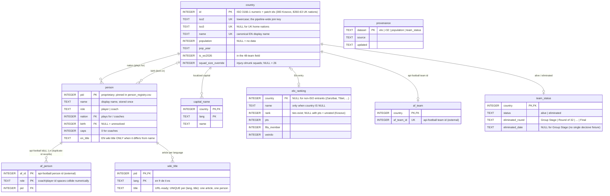

# Data pipeline

Scripts and source data for the Mundial 2026 choropleth map and live-match page.

All scripts resolve paths relative to `__file__`, so `python3 pipeline/foo.py`
and `cd pipeline && python3 foo.py` are equivalent.

Output that the `mundial` frontend actually fetches lives in the `data/`
submodule (see `CLAUDE.md` for the commit workflow — data changes commit
in the submodule first, then the pointer is bumped here). As of the July
2026 frontend migration that's `data/elo_rank.json`, `data/r32_teams.json`,
`data/uk-nations.geojson`, and the pid-keyed `data/v2/` files — **not**
`map_data.json`/`player_wiki.json`/`wiki_<lang>.json`, which now live in
`pipeline/` as build-internal intermediates (see "Relational model" below).
`extras/` scripts (GDP/HDI/Elo history, feeding only the standalone `pages/`
charts) have their commands in `CLAUDE.md`'s build sequence, not here.

---

## Prerequisites

```bash
pip install requests beautifulsoup4 pandas lxml pycountry jellyfish
```

---

## Script index

| Script | Output | Notes |
|--------|--------|-------|
| `fetch_countries.py` | `countries.json` | Population + multilingual capital from mledoze + World Bank + Wikidata. Auto-runs `patch_uk_nations.py` + `patch_kosovo.py` at the end. |
| `patch_uk_nations.py` | `countries.json` (in-place) | Adds UK home nations (ids 8260–8263) |
| `patch_kosovo.py` | `countries.json`, `data/elo_rank.json` (in-place) | Adds Kosovo (id 383) |
| `country_registry.py` | _(module, no output)_ | Canonical country-identity resolver — see below. Run directly (`python3 pipeline/country_registry.py`) for a self-test. |
| `wc2026_birthplaces.py` | `wc2026_players.csv` | Scraper: Wikipedia squad page + Wikidata birth lookup |
| `wc2026_coaches.py` | `wc2026_coaches.csv` | Scraper: coaches from Wikipedia squad page + Wikidata birth lookup |
| `build_json.py` | `pipeline/map_data.json` | Rebuilds the main data file from the CSVs + `countries.json` |
| `add_wiki_urls.py` | `pipeline/map_data.json` (in-place) + `pipeline/wiki_<lang>.json` ×5 | Resolves Wikipedia identity (players + coaches) — see "Wiki data" below |
| `validate_country_coverage.py` | _(stdout, exit code)_ | Coverage gate — run after the pipeline, before committing |
| `api_football_countries.py` | `country_codes_cache.json` (gitignored) | _(module)_ Cached api-football `/countries` fallback map — see "Country identity" below |
| `fetch_r32_teams.py` | `data/r32_teams.json` | Round-of-32 teams from api-football, resolved through `country_registry.py` |
| `build_player_wiki.py` | `pipeline/player_wiki.json`, `player_aliases_manual.json` | Player/coach identity resolver — see "Player identity" below |
| `update_elo_rankings.py` | `data/elo_rank.json` | Fetches current Elo ratings from eloratings.net |
| `fetch_team_status.py` | `pipeline/team_status.json` | Tournament elimination status from api-football fixtures — see "Team status" below |
| `load.py` | `mundial.db` (gitignored), `person_registry.csv` | Phase 1 of the relational build — see "Relational model" below |
| `export.py` | `data/v2/` (8 files) | Phase 2 — exports pid-keyed view files from `mundial.db` |

---

## Relational model (`schema.sql` → `mundial.db` → `data/v2/`)

The normalized canonical model of the whole dataset. Runs **after** the
existing scripts, reading their outputs as-is — nothing upstream changes:

```bash
python3 pipeline/load.py     # inputs -> pipeline/mundial.db (rebuildable, gitignored)
python3 pipeline/export.py   # mundial.db -> data/v2/{map,live,wiki_<lang>}.json, atomically
```

`schema.sql` holds the entities with real FK/UNIQUE constraints — data
inconsistencies fail the load instead of shipping — plus the `view_*`
views that `export.py` serializes.



Facts the schema encodes that the JSON files never enforced: api-football coach and player ids are separate id
spaces that collide numerically; one person can hold several api-football
ids (duplicate-id records); Elo ranks have ties; a Wikipedia article
belongs to exactly one person.

Every person gets a **`pid`** — a small integer that replaces the
`wikiTitle` string as the cross-file join key in the `data/v2/` files
(`map.json` mirrors `map_data.json` with `pid` instead of `wikiTitle`;
`live.json` maps `iso2 → af_id → {pid, birthCountry}`; each
`wiki_<lang>.json` holds a `titles` array indexed by pid). Roughly 44%
smaller live-page payload gzipped. pids are pinned forever in
`person_registry.csv` (committed): matched by `(role, api-football id)`
first, then `(nation iso2, name)`; new persons append, pids are never
reused. All 8 exports are written together from one DB state, so pids
can't disagree across files.

**`data/v2/` is what the `mundial` frontend fetches** (migrated July 2026).
`pipeline/map_data.json`, `pipeline/player_wiki.json`, and
`pipeline/wiki_<lang>.json` are `load.py`'s inputs only — pipeline-internal
now, committed in `pipeline/` (not the submodule, not gitignored: producing
them hits live external APIs, so they're not cheap to regenerate on a
whim — same reasoning as the committed CSVs).

---

## Team status (`fetch_team_status.py` → `team_status` table → `data/v2/status.json`)

Elimination status, one row per WC2026 team, fetched from api-football
fixture results:

- **Knockout rounds** (Round of 32 onward) — every fixture eventually has a
  decisive winner (extra time / penalties resolve draws), so a finished
  fixture's loser is unambiguously eliminated at that round, dated to the
  fixture's kickoff date, with `lostTo` recording who beat them.
- **Group stage** — WC2026's format (12 groups of 4, top 2 + 8 best
  third-place teams advance) has real tie-break rules `fetch_team_status.py`
  does **not** replicate. Instead, once every group-stage fixture is
  finished, any WC2026 team that doesn't appear in a Round of 32 fixture is
  eliminated — non-appearance in the round of 32 bracket *is* the tie-break
  result, already computed by whoever seeds that round, so there's nothing
  left to derive. Tagged `"Group Stage"`, undated, no `lostTo` (round-robin,
  no single deciding opponent — same condition as the missing date).

`data/v2/status.json` carries **only eliminated teams** — `{iso2: {round,
date?, lostTo?}}`. A team absent from the file is still alive; the client
never needs a positive "still in it" list, since the alternative (listing
all 48 minus eliminated) grows the payload as the tournament empties out,
exactly backwards from what you'd want. Verified against the live API
mid-build: group stage fully finished (48 → 32) plus 10 of 16 Round of 32
fixtures decided produced 26 eliminated teams, `status.json` at ~200 bytes
gzipped.

**`lostTo` isn't just record-keeping** — a team that appears as someone
else's `lostTo` has thereby proven it *won* that round and is now playing
the next one. That derives every **alive** team's current round too, from
this same eliminated-only data, with no separate field or export needed:
walk the furthest round any team is recorded as having won; its current
round is the one after that. `schema.sql`'s `view_current_round` implements
exactly this (debug/verification only, not exported) — reproduced against
the live state above: `{'Round of 16': 10, 'Round of 32': 12}`, i.e. 10
teams who've already won their Round of 32 fixture and are now contesting
Round of 16, and 12 still mid–Round of 32 — a distinction `status.json`'s
eliminated-only rows can't otherwise make (both groups are simply absent).

Same living-dataset caveat as `build_player_wiki.py` / `update_elo_rankings.py`
— re-run whenever fixtures finish, not once. `KNOCKOUT_STAGES` in
`fetch_team_status.py` hardcodes the round-name strings api-football
returned when this was verified against the live API; if a future re-run
warns about an unrecognized round name, add it there (see
`fetch_r32_teams.py`'s `find_r32_round` for the "naming varies by
tournament edition" precedent this follows).

---

## Core pipeline (squad + country data)

See [`pipeline/CLAUDE.md`](CLAUDE.md)'s "Core pipeline" section for the
exact, canonical command sequence — kept in one place so it can't drift out
of sync with what's documented here.

---

## Country identity (iso2 is the join key)

The same country shows up under different free-text spellings across upstream
sources (Wikipedia, Wikidata, eloratings.net, api-football, World Bank, …) —
e.g. DR Congo alone appears as `"DR Congo"`, `"Congo, The Democratic Republic
of the"`, and `"Congo DR"` depending on the source. `country_registry.py` is
the single place that resolves a raw name to a canonical lowercase iso2
(`resolve_iso2()`), and the single place output scripts get a display name
from (`canonical_name()` / `display_name()`). Its data lives in
`country_aliases.json` (known spelling variants, keyed by iso2, plus the
current 48-team WC2026 field).

An unrecognized name raises `UnknownCountryError` instead of silently falling
through to a heuristic — add the missing spelling to `country_aliases.json`
rather than adding another local override dict. `build_json.py`,
`update_elo_rankings.py`, `fetch_r32_teams.py`, `wc2026_birthplaces.py`, and
`wc2026_coaches.py` all resolve through this module. `extras/` scripts
(GDP/HDI/elo_history) still use their own independent name maps — not yet
migrated.

`fetch_r32_teams.py` and `fetch_team_status.py` also each carry a fallback
name → iso2 map for the rare name `country_registry.py` doesn't recognize at
all (raw api-football strings, not our alias data — and known unreliable on
some entries, e.g. api-football has been observed to swap Congo /
Congo-DR's codes). That map comes from api-football's `/countries` endpoint,
which is static reference data, so `api_football_countries.py` caches it to
`pipeline/country_codes_cache.json` (gitignored) instead of spending an API
credit on it every run — both scripts share this one cached fetch instead of
each hitting `/countries` themselves. Pass `--refresh-countries` to either
script (or delete the cache file) to force a refetch, e.g. if api-football
adds a country it didn't previously have.

Run `python3 pipeline/validate_country_coverage.py` after the pipeline: it
resolves every raw country string currently in the CSVs and in
`pipeline/map_data.json`/`data/elo_rank.json`/`data/r32_teams.json`, and
checks every current WC2026 nation actually has rows in both CSVs. A new
upstream spelling variant shows up here as a failed build, not a silent
wrong-flag bug weeks later.

---

## Player/coach identity (`build_player_wiki.py`)

Same root problem as country identity, one level down: a player's name from
Wikipedia (`wc2026_players.csv`/`wc2026_coaches.csv`) often doesn't match the
name api-football renders for the same person in live lineup data —
abbreviated initials ("L. Martinez"), transliteration variants, dropped
middle names, stage names (Bono = Yassine Bounou), even different names for
the same api-football id across different fixtures. `build_player_wiki.py`
resolves this once, at build time, for everyone who's appeared in a finished
WC2026 fixture, via a 7-tier rule-based matcher (`norm` → `initials+tail` →
`prefix` → `middle-optional` → `phonetic` → `mononym` → `soundex`, in that
order of confidence) plus `player_aliases_confirmed.json` (hand-verified
pairs the matcher can't resolve on its own, keyed by api-football's numeric
id so a future name-string change for the same person doesn't break it).

Exports `pipeline/player_wiki.json`, keyed by iso2 then by api-football's
numeric player/coach id — **id, not name**, since api-football has been
observed to render the same person differently across fixtures/endpoints.
`pipeline/load.py` re-keys this by `pid` into `data/v2/live.json`, which
`mundial`'s `wc2026_live.html` looks up directly by `player.id`/`coach.id`;
no name matching happens client-side at all anymore.

Two safety nets worth knowing about:
- If 2+ different people in the same team render with the *exact same*
  string (e.g. Argentina's two "L. Martinez"), the matcher can't
  disambiguate from text alone and routes both straight to manual review
  instead of guessing via a similarity-ratio tiebreak — this caught a case
  where the ratio tiebreak had silently picked the wrong one.
- Residual unresolved names go to `player_aliases_manual.json` with a
  `_note` where the reason is a genuine non-issue (injury, api-football
  missing data entirely) rather than something to fix. **Check the note
  before treating an entry as a bug** — e.g. a coaching change mid-tournament
  (Tunisia: Lamouchi → Renard) showed up here once as a false "mismatch";
  it wasn't a name problem, `wc2026_coaches.py` just needed a re-scrape.

This is a living dataset, not a one-time export — new fixtures introduce ids
never seen before (Round of 16 onward, injury returns), so re-run it on the
same cadence as `update_elo_rankings.py`/`fetch_r32_teams.py`, not once.

---

## Wiki data: `wikiTitle` + per-language files

`add_wiki_urls.py` does **not** write full Wikipedia URLs onto player
objects anymore. Instead:

- Every player/coach in `pipeline/map_data.json` (and every entry in
  `pipeline/player_wiki.json`) carries a single `wikiTitle` field — the EN
  Wikipedia title, e.g. `"Lionel Mpasi"` — not a URL.
- 5 files, `pipeline/wiki_en.json` / `wiki_fr.json` / `wiki_de.json` /
  `wiki_it.json` / `wiki_es.json`, each `{"urlTemplate": "https://<lang>.
  wikipedia.org/wiki/{title}", "titles": {<EN title>: <url-ready title for
  that language>}}` — keyed by the same `wikiTitle` string.

`name_to_title` (the map from a linked Wikipedia name to its EN title) is
keyed by **`(nation, name)`, not name alone** — two different players can
share a display name across different squads (WC2026 has exactly this case:
Argentina's and Uruguay's squads each have an "Emiliano Martínez"), and a
flat name key would silently hand one of them the other's article. Each
squad table's country comes from the heading immediately before it on the
Wikipedia squads page; a heading that doesn't resolve to a country (the
statistics tables at the bottom of the page) is skipped.
`build_player_wiki.py`'s own `map_data.json` lookup is scoped the same way,
for the same reason.

pipeline/load.py re-keys `wikiTitle` by `pid` into `data/v2/wiki_<lang>.json`
(`titles` as a pid-indexed array instead of a dict keyed by title) — a
client fetches **one** of the 5 language files (matching its active locale)
and does a plain array lookup + string substitution —
`urlTemplate.replace('{title}', titles[pid])` — no URL-building or encoding
logic needed client-side, and the other 4 languages are never downloaded.
This exists because the old `wiki_langs: {en,fr,de,it,es}` blob was over
half of `map_data.json`'s size, duplicated again in `player_wiki.json`, and
~80% of it was languages any single user never touches.

`build_json.py`'s wiki-preservation cache (so re-running it after a fresh
CSV doesn't lose Wikipedia identity already resolved) keys on `wikiTitle` —
if you're re-running `add_wiki_urls.py` from scratch anyway, this doesn't
matter, but it means partial pipeline re-runs stay safe.

---

## UK home nations & Kosovo

Standard ISO tables don't include UK home nations (ids 8260–8263, alpha2
`gb-eng`/`gb-sct`/`gb-wls`/`gb-nir`) or Kosovo (id 383, `xk`). They're
injected by `patch_uk_nations.py` / `patch_kosovo.py`, both auto-called at
the end of `fetch_countries.py`. `update_elo_rankings.py` re-fetches from
eloratings.net (which doesn't have Kosovo), so re-run `patch_kosovo.py`
afterward if you ever call `update_elo_rankings.py` outside the documented
order above.

---

## Squad-scrape data-quality notes

Two scraping bugs that used to require **manual CSV edits** are now fixed at
the root cause in `wc2026_birthplaces.py` — a plain re-scrape resolves them,
no hand-editing needed anymore:

- **Citation footnotes corrupting `birth_country`**: a player's Wikipedia
  infobox sometimes has a footnote marker (`[1]`) right after the country
  name; the old scraper didn't strip it before parsing, so the parsed
  country ended up as a stray `]` instead of the real country (silently
  dropped by `build_json.py`'s malformed-value guard — the player just
  vanished from the map). Fixed by stripping `<sup class="reference">` tags
  before extracting text.
- **Country-only Wikidata birthplaces discarding the country too**: when
  Wikidata only records a birthplace at country granularity (no specific
  city — `P19` points directly at the country entity), the old code's guard
  against writing a bogus "city" equal to the country threw away the country
  as well, dropping the player from both `natives` and exports. Fixed to set
  `birth_country` independently of whether a distinct `birth_city` exists.

If a player is *still* missing a birthplace after a re-scrape, neither
Wikidata nor their Wikipedia infobox has it recorded at all (verify by
checking both directly before assuming it's a bug) — add a one-off entry to
`BIRTH_CITY_OVERRIDES` in `build_json.py` with a cited external source (see
the existing entries, e.g. Tarek Alaa, for the pattern), rather than editing
the CSV directly (`wc2026_birthplaces.py` regenerates it from scratch on
every run, so a raw CSV edit is lost on the next scrape).

**Mid-tournament coaching changes**: `wc2026_coaches.py` now keeps the
*last* coach-name link found in a "Coach:" element rather than the first,
since Wikipedia lists former-then-current when a coach is replaced
mid-tournament ("Coach: A (first match) / B (remaining matches)"). Still
worth spot-checking `wc2026_coaches.csv` after a re-scrape during the
tournament in case Wikipedia itself hasn't been updated yet.

---

## Partial updates

### Re-scrape only (after a squad change)

```bash
python3 pipeline/wc2026_birthplaces.py
python3 pipeline/build_json.py
python3 pipeline/add_wiki_urls.py       # only new/changed players need new API calls
python3 pipeline/validate_country_coverage.py
python3 pipeline/load.py && python3 pipeline/export.py   # re-export data/v2/
```

### Player/coach identity after new fixtures are played

```bash
python3 pipeline/build_player_wiki.py
python3 pipeline/load.py && python3 pipeline/export.py   # re-export data/v2/
```

Check `player_aliases_manual.json` afterward — resolve genuine name
mismatches by adding an entry to `player_aliases_confirmed.json` (see its
`_comment` field for the exact format and how entries have been confirmed so
far: birth-date cross-reference against api-football's `/players`/`/coachs`
endpoints, or a cited web search for stage names/nicknames).

### Team status after new fixtures are played

```bash
python3 pipeline/fetch_team_status.py
python3 pipeline/load.py && python3 pipeline/export.py   # re-export data/v2/status.json
```

Same cadence as the identity refresh above — run both together whenever
fixtures finish, since they both read the same `/fixtures` state.

Any of these ends with `git -C data add v2 && git -C data commit && git -C
data push`, then bump the submodule pointer here — see `CLAUDE.md`'s
commit workflow. `pipeline/map_data.json`, `player_wiki.json`, and
`wiki_<lang>.json` are ordinary tracked files in this repo now (not the
submodule), so they commit with the rest of your `pipeline/` changes.
