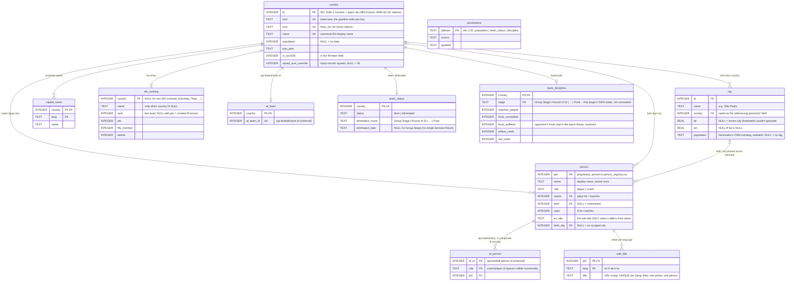

# Data pipeline

Scripts and source data for the Mundial 2026 choropleth map and live-match page.

All scripts resolve paths relative to `__file__`, so `python3 pipeline/foo.py`
and `cd pipeline && python3 foo.py` are equivalent.

Output that the `mundial` frontend actually fetches lives in the `data/`
submodule (see `CLAUDE.md` for the commit workflow — data changes commit
in the submodule first, then the pointer is bumped here). As of the July
2026 frontend migration that's `data/elo_rank.json`,
`data/uk-nations.geojson`, and the pid-keyed `data/v2/` files — **not**
`map_data.json`/`player_wiki.json`/`wiki_<lang>.json`/`r32_teams.json`, which
now live in `pipeline/` as build-internal intermediates (see "Relational
model" below). `r32_teams.json`'s frontend-facing role (api-football team id
-> iso2) was folded into `data/v2/live.json`'s `teams` key.
`extras/` scripts (GDP/HDI/Elo history, feeding only the standalone `pages/`
charts) have their commands in `CLAUDE.md`'s build sequence, not here.

---

## Prerequisites

```bash
pip install requests beautifulsoup4 pandas lxml pycountry jellyfish numpy scipy
```

---

## Script index

| Script | Output | Notes |
|--------|--------|-------|
| `fetch_countries.py` | `countries.json` | Population + multilingual capital from mledoze + World Bank + Wikidata. Auto-runs `patch_uk_nations.py` + `patch_kosovo.py` at the end. |
| `patch_uk_nations.py` | `countries.json` (in-place) | Adds UK home nations (ids 8260–8263) |
| `patch_kosovo.py` | `countries.json`, `data/elo_rank.json` (in-place) | Adds Kosovo (id 383) |
| `country_registry.py` | _(module, no output)_ | Canonical country-identity resolver — see below. Run directly (`python3 pipeline/country_registry.py`) for a self-test. |
| `wc2026_birthplaces.py` | `wc2026_players.csv` | Scraper: Wikipedia squad page + Wikidata birth lookup |
| `wc2026_coaches.py` | `wc2026_coaches.csv` | Scraper: coaches from Wikipedia squad page + Wikidata birth lookup |
| `build_json.py` | `pipeline/map_data.json` | Rebuilds the main data file from the CSVs + `countries.json` |
| `add_wiki_urls.py` | `pipeline/map_data.json` (in-place) + `pipeline/wiki_<lang>.json` ×5 | Resolves Wikipedia identity (players + coaches) — see "Wiki data" below |
| `validate_country_coverage.py` | _(stdout, exit code)_ | Coverage gate — run after the pipeline, before committing |
| `api_football_countries.py` | `country_codes_cache.json` (gitignored) | _(module)_ Cached api-football `/countries` fallback map — see "Country identity" below |
| `fetch_r32_teams.py` | `pipeline/r32_teams.json` | Round-of-32 teams from api-football, resolved through `country_registry.py` |
| `build_player_wiki.py` | `pipeline/player_wiki.json`, `player_aliases_manual.json` | Player/coach identity resolver — see "Player identity" below |
| `update_elo_rankings.py` | `data/elo_rank.json` | Fetches current Elo ratings from eloratings.net |
| `fetch_fixtures.py` | `data/fixtures.json` | Every WC2026 fixture, past and planned — see "Fixtures" below |
| `fetch_discipline_stats.py` | `pipeline/discipline_stats.json` | Per-fixture foul/card counts from api-football's fixture statistics — see "Discipline stats" below |
| `geocode_birthplaces.py` | `pipeline/geocode_cache.json` | Geocodes each player/coach's scraped birth city to lat/lon via OpenStreetMap Nominatim + `pipeline/geocode_overrides.json` — see "Birthplace geocoding" below |
| `load.py` | `mundial.db` (gitignored), `person_registry.csv` | Phase 1 of the relational build; also derives tournament elimination status from `data/fixtures.json` — see "Relational model" and "Team status" below |
| `export.py` | `data/v2/` (10 files) | Phase 2 — exports pid-keyed view files from `mundial.db` |
| `fetch_population_points.py` | `pipeline/population_points.csv` | Population-weighted point cloud (GeoNames), the population denominator for `kde_risk.py` — see "KDE talent-production surface" below |
| `kde_risk.py` | `data/kde_risk.json`, `data/hotspots.json` | Population-normalized "talent production" relative-risk surface + hotspot list — see "KDE talent-production surface" below |

---

## Relational model (`schema.sql` → `mundial.db` → `data/v2/`)

The normalized canonical model of the whole dataset. Runs **after** the
existing scripts, reading their outputs as-is — nothing upstream changes:

```bash
python3 pipeline/load.py     # inputs -> pipeline/mundial.db (rebuildable, gitignored)
python3 pipeline/export.py   # mundial.db -> data/v2/{map,live,wiki_<lang>}.json, atomically
```

`schema.sql` holds the entities with real FK/UNIQUE constraints — data
inconsistencies fail the load instead of shipping — plus the `view_*`
views that `export.py` serializes.



Facts the schema encodes that the JSON files never enforced: api-football coach and player ids are separate id
spaces that collide numerically; one person can hold several api-football
ids (duplicate-id records); Elo ranks have ties; a Wikipedia article
belongs to exactly one person.

Every person gets a **`pid`** — a small integer that replaces the
`wikiTitle` string as the cross-file join key in the `data/v2/` files
(`map.json` mirrors `map_data.json` with `pid` instead of `wikiTitle`;
`live.json` maps `iso2 → af_id → {pid, birthCountry}`; each
`wiki_<lang>.json` holds a `titles` array indexed by pid). Roughly 44%
smaller live-page payload gzipped. pids are pinned forever in
`person_registry.csv` (committed): matched by `(role, api-football id)`
first, then `(nation iso2, name)`; new persons append, pids are never
reused. All 9 exports are written together from one DB state, so pids
can't disagree across files.

**`data/v2/` is what the `mundial` frontend fetches** (migrated July 2026).
`pipeline/map_data.json`, `pipeline/player_wiki.json`, and
`pipeline/wiki_<lang>.json` are `load.py`'s inputs only — pipeline-internal
now, committed in `pipeline/` (not the submodule, not gitignored: producing
them hits live external APIs, so they're not cheap to regenerate on a
whim — same reasoning as the committed CSVs).

---

## Team status (`load.py`'s `compute_eliminated()` → `team_status` table → `data/v2/status.json`)

Elimination status, one row per WC2026 team, derived from `data/fixtures.json`
(itself fetched by `fetch_fixtures.py` — no separate api-football call):

- **Knockout rounds** (Round of 32 onward) — every fixture eventually has a
  decisive winner (extra time / penalties resolve draws; `fixtures.json`'s
  `winner` field carries api-football's own home/away/null judgement rather
  than being recomputed from goals), so a finished fixture's loser is
  unambiguously eliminated at that round, dated to the fixture's kickoff
  date, with `lostTo` recording who beat them.
- **Group stage** — WC2026's format (12 groups of 4, top 2 + 8 best
  third-place teams advance) has real tie-break rules `compute_eliminated()`
  does **not** replicate. Instead, once every group-stage fixture is
  finished, any WC2026 team that doesn't appear in a Round of 32 fixture is
  eliminated — non-appearance in the round of 32 bracket *is* the tie-break
  result, already computed by whoever seeds that round, so there's nothing
  left to derive. Tagged `"Group Stage"`, undated, no `lostTo` (round-robin,
  no single deciding opponent — same condition as the missing date).

`data/v2/status.json` carries **only eliminated teams** — `{iso2: {round,
date?, lostTo?}}`. A team absent from the file is still alive; the client
never needs a positive "still in it" list, since the alternative (listing
all 48 minus eliminated) grows the payload as the tournament empties out,
exactly backwards from what you'd want. Verified against the live API
mid-build: group stage fully finished (48 → 32) plus 10 of 16 Round of 32
fixtures decided produced 26 eliminated teams, `status.json` at ~200 bytes
gzipped.

**`lostTo` isn't just record-keeping** — a team that appears as someone
else's `lostTo` has thereby proven it *won* that round and is now playing
the next one. That derives every **alive** team's current round too, from
this same eliminated-only data, with no separate field or export needed:
walk the furthest round any team is recorded as having won; its current
round is the one after that. `schema.sql`'s `view_current_round` implements
exactly this (debug/verification only, not exported) — reproduced against
the live state above: `{'Round of 16': 10, 'Round of 32': 12}`, i.e. 10
teams who've already won their Round of 32 fixture and are now contesting
Round of 16, and 12 still mid–Round of 32 — a distinction `status.json`'s
eliminated-only rows can't otherwise make (both groups are simply absent).

Same living-dataset caveat as `build_player_wiki.py` / `update_elo_rankings.py`
— re-run whenever fixtures finish, not once. `KNOCKOUT_STAGES` in `load.py`
hardcodes the round-name strings api-football returned when this was
verified against the live API; if a future re-run warns about an
unrecognized round name, add it there (see `fetch_r32_teams.py`'s
`find_r32_round` for the "naming varies by tournament edition" precedent
this follows).

---

## Fixtures (`fetch_fixtures.py` → `data/fixtures.json`)

Every WC2026 fixture, played or scheduled, straight from api-football's
`/fixtures` endpoint: `{id, date, round, status, home, away, goals: {home,
away}, winner}` per fixture, `home`/`away` resolved to iso2. Unplayed
fixtures carry `status: "NS"`, `goals: {home: null, away: null}`, and
`winner: null`. Every `"Group Stage - N"` fixture additionally carries a
`group` field (`"A"`–`"L"`).

The payload also carries a top-level `groups` map (`{"A": [iso2, ...], ...}`,
12 groups of 4, alphabetical within each group) — the 4-team partition is
technically derivable from the fixture graph alone (each group is a disjoint
K4 clique in the group-stage rounds), but the **letter** isn't: `/fixtures`'
own `round` field only ever carries the matchday (`"Group Stage - 1"`), never
the group name. `group`, `groups`, and `standings` (below) all come from one
extra call to api-football's `/standings` endpoint (`fetch_standings()`),
matched back to teams the same way `/fixtures` teams are (`team_iso2()`).
That endpoint also emits a synthetic 13th bucket literally named `"Group
Stage"` — every non-qualifying team lumped together regardless of which real
group it was in — which `fetch_standings()` explicitly filters out rather
than letting it clobber those teams' real letters. Since groups are fixed at
the draw, `group`/`groups` never need re-fetching once the group stage ends,
even though `fetch_fixtures.py` re-fetches them (cheaply) on every run.

The payload also carries a top-level `standings` map (`{"A": [{iso2, rank,
points, played, win, draw, lose, goalsFor, goalsAgainst, goalsDiff}, ...],
...}`, ordered by `rank`) — a full classement table per group, straight from
the same `/standings` rows `group`/`groups` are built from. `rank` is taken
as api-football computes it rather than resorted by points here, since it
already encodes FIFA's actual tie-break rules (head-to-head record,
discipline, ...) — reimplementing that client-side would risk disagreeing
with the official standings on exactly the edge cases tie-breaks exist for.
Unlike `groups`, `standings` changes every time a group-stage fixture
finishes, so (unlike `group`/`groups`) it's meant to be re-fetched on every
run, same cadence as fixture scores.

Written directly to `data/fixtures.json` (the submodule), the same way
`update_elo_rankings.py` writes `data/elo_rank.json` — **not** routed through
`load.py`/`export.py` for its own shape. `load.py` does read it, though: it's
the sole input to `compute_eliminated()` (see "Team status" above), so a
single fetch here now covers both the raw client-facing fixture list and
the derived elimination status — no second api-football call, and no way
for the two to drift out of sync the way a separate fetch script could.

Same living-dataset cadence as `update_elo_rankings.py` — re-run whenever
fixtures are added or results come in (`update_fixtures.sh` automates the
full refresh + commit).

---

## Discipline stats (`fetch_discipline_stats.py` → `team_discipline` table → `data/v2/discipline.json`)

Per-fixture foul/card counts from api-football's `/fixtures/statistics`,
fetched for every **finished** (`FT`/`AET`/`PEN`) fixture in
`data/fixtures.json` — no separate `/fixtures` call. `"Fouls suffered"`
isn't a field api-football exposes: it's derived per fixture as the
*opponent's* `Fouls` value in that same match.

`fetch_discipline_stats.py` only resolves team identity and writes raw
per-fixture counts — `{fixture_id: {iso2: {foulsCommitted, yellowCards,
redCards}}}` — to `pipeline/discipline_stats.json`; it does **not**
aggregate across fixtures or classify rounds itself. Pipeline-internal,
committed (same "hits a live API, not cheap to redo" reasoning as
`r32_teams.json`). Per-fixture API responses are cached in
`pipeline/discipline_stats_cache.json` (also committed), so a re-run after
new fixtures finish only fetches the new ones.

All aggregation happens in `load.py`'s `compute_discipline()`, which
crosses `discipline_stats.json` against `data/fixtures.json` and buckets
each fixture into a stage via **the same `classify_round()`**
`compute_eliminated()` uses for elimination status (see "Team status"
above) — so a fixture's discipline stage can never disagree with its
elimination round. Each `team_discipline` row is one (team, stage)'s **own**
totals, not cumulative; `schema.sql`'s `view_discipline` turns that into a
running "cumulative through this stage" total per team via a window
function (`SUM(...) OVER (PARTITION BY team ORDER BY stage)`), the same
derive-don't-store approach as `view_squad_size`. `view_team_stage` (factored
out of the old inline `view_discipline` logic) gives each team's *current*
stage/eliminated flag, reusing `team_status`/`view_current_round` — see
"Team status" above.

This exists specifically so a client can show figures "as of round X"
without a card from a later round leaking into an earlier one — e.g. a red
card shown in the Quarter-finals must not appear in that team's Round of 16
figures. `data/v2/discipline.json` is `{iso2: {matchesPlayed,
foulsCommitted, foulsSuffered, avgFoulsCommitted, avgFoulsSuffered,
yellowCards, redCards, foulsPerCard, stage, eliminated, byStage}}`, one
entry per WC2026 team. The top-level fields are the team's latest
cumulative totals (through the furthest stage actually played so far);
`byStage` is `{stage: {same fields minus stage/eliminated}}`, the same
cumulative totals frozen at each earlier stage too, so a client picks
`byStage["Round of 16"]` directly instead of doing its own running-total
math. `foulsPerCard` is `null` for a team/stage with zero cards so far (not
`0` or `Infinity`). `eliminated` is a plain boolean here — unlike
`status.json`, which uses absence-from-file instead.

**Not yet wired into `update_fixtures.sh`** — that script only re-runs
`fetch_fixtures.py`, so `data/v2/discipline.json` goes stale between manual
`fetch_discipline_stats.py` runs even as fixtures/status stay current. Fold
it in (and add `v2/discipline.json` to the script's commit-diff check)
before relying on this data staying fresh automatically.

---

## Birthplace geocoding (`geocode_birthplaces.py` → `city` table → `data/v2/birthplace.json`)

`wc2026_birthplaces.py`/`wc2026_coaches.py` already scrape a `birth_city`
string per person into `wc2026_players.csv`/`wc2026_coaches.csv` (Wikipedia
squads table → Wikidata P19 → per-player infobox fallback — see
`pipeline/CLAUDE.md`'s "Birthplace overrides" section); it just never used to
leave those CSVs. `build_json.py` now carries it through as `birthCity` on
every player/coach object in `pipeline/map_data.json` (exports and natives
alike), and `geocode_birthplaces.py` resolves each unique `(birth_city,
birth_country)` pair (cities are shared by many players — e.g. several
Brazilians born in São Paulo — so pairs are deduplicated before any request
goes out) to lat/lon via OpenStreetMap's Nominatim search API (no key
needed), respecting Nominatim's usage policy: max 1 request/second, an
identifying `User-Agent`. Results are cached in `pipeline/geocode_cache.json`
(committed, same "hits a live external API, not cheap to redo casually"
reasoning as `discipline_stats_cache.json`) keyed by the exact `"City,
Country"` query string, so a rerun only geocodes pairs it hasn't seen before
— a pair Nominatim couldn't resolve is cached as `null` too, so it isn't
retried every run either (pass `--retry-misses` to re-attempt just those, or
`--refresh-cache` to force a full re-geocode of everything).

Nominatim's own top-ranked "importance" match is sometimes confidently
**wrong**, not just imprecise — a same-named administrative region (Italian
provinces are usually named after their capital city) or an unrelated
non-place feature (a railway station) can outrank the actual settlement.
`_query_nominatim()` guards against both: a bounding-box containment check
prefers a nested settlement candidate over a region-level top result only
when its coordinates genuinely fall inside that region's own bbox (ruling
out same-named-but-unrelated places elsewhere), and `featureType=settlement`
excludes non-place results server-side. `FALLBACK_PATTERNS` separately
retries with an administrative qualifier stripped ("12th arrondissement of
Paris" → "Paris") when the direct query comes back empty. The residual
minority — corrupted source strings, small villages/parishes Nominatim
doesn't index under that name, or a case ambiguous enough to need actual
research to identify — falls through to `pipeline/geocode_overrides.json`,
a hand-verified, cited-source fallback (same only-fills-gaps pattern as
`pipeline/birthplace_overrides.json`, one level down the pipeline). Its
`_known_unresolved` section documents entries that were researched and
deliberately left out rather than guessed — e.g. two persons whose scraped
`birth_city` is literally their birth country's own name (no specific city
was ever known). One entry ("Piranshahr Sugar Factory, Iran") turned out to
be an upstream Wikidata P19 error rather than a hard-to-geocode place at
all — Saman Ghoddos's own Wikipedia infobox/prose say Malmö, Sweden — and
was fixed at the source instead, via `build_json.py`'s
`BIRTH_CITY_OVERRIDES` (see "Squad-scrape data-quality notes" below), so it
no longer appears here.

`load.py` looks each person's `(birth_city, birth-country display name)` up
in that cache and gets-or-creates the matching `city` row (deduplicated by
`(name, country)` — see the ER diagram above), so 30-odd Brazilians born in
São Paulo all point at the same `city.id` instead of repeating its name and
coordinates 30 times; `person.birth_city` is just an FK into it. A person
with no scraped city gets no `city` row at all; a scraped city Nominatim
couldn't geocode still gets a `city` row (so it isn't re-geocoded as if
never seen), just with `lat`/`lon` left NULL rather than a bogus fallback
location. `view_birthplace` joins person → city and selects only the rows
with a resolved `lat`/`lon`, and `export.py`'s `build_birthplace()` turns
that into `data/v2/birthplace.json`: `{pid: {city, lat, lon, population?}}`,
one entry per successfully geocoded person — best-effort, not every person
is expected to be present, matching the "all players" table's own
filtered/partial nature.

**Population** (`city.population`) is Nominatim's own OSM `population`
extratag for the resolved place, read from the exact same query that
resolved `lat`/`lon` — requested via `extratags=1`, not a second lookup
against a different dataset. This was a deliberate call: `population_points.csv`
(GeoNames' `cities1000` dump, already in the pipeline for `kde_risk.py`'s
KDE weighting) also carries population, and cross-referencing it by nearest
coordinate was the first idea — but that's a NEW fuzzy-identity problem
(distance cutoffs, risk of snapping to the wrong nearby place) layered on
top of a birth city this script has already resolved once. Reading the tag
straight off the same Nominatim result sidesteps that entirely, at the cost
of coverage: OSM population tagging is inconsistent, so most small
towns/villages simply won't have one. `None`/absent is the normal case here,
not a bug. `geocode_overrides.json` entries never carry a population — they
have no live Nominatim result to read a tag from.

Stored and shipped as **TEXT, not a number** — OSM's own tag isn't reliably
numeric (a malformed value like `"2.618"` has been seen live) and nothing
in this pipeline or the frontend does arithmetic on it, so it's carried
through exactly as OSM has it rather than coerced/validated.

Cache entries written before this field existed lack a `population` key
entirely; `python3 pipeline/geocode_birthplaces.py --add-population`
backfills it for already-resolved, non-override entries without
re-resolving `lat`/`lon`, at the same 1 req/s Nominatim rate limit as every
other pass here.

Squads don't change mid-tournament, so this doesn't need re-running on the
fixtures cadence the way discipline/status/live do — only after a genuine
squad re-scrape (a new `wc2026_birthplaces.py`/`wc2026_coaches.py` +
`build_json.py` pass). **Not wired into `update_fixtures.sh`.**

---

## KDE talent-production surface (`kde_risk.py` → `data/kde_risk.json` + `data/hotspots.json`)

A "does this place produce more WC2026 talent than its population would
predict" map layer, built once the birthplace geocoding above exists —
`kde_risk.py` reads `pipeline/mundial.db`'s geocoded birth cities directly
(no `data/v2/birthplace.json` round-trip needed, since the DB already has
`city.lat`/`lon`/`country` in one join).

**Two Gaussian KDEs on the same grid.** A 0.25°, world-extent grid
(1440×720 cells), with a haversine-distance Gaussian kernel (`--bandwidth-km`,
default 75) applied to two different point clouds on that SAME grid so
they're directly comparable cell-by-cell:
- **Player density** — every geocoded WC2026 birth city, weighted by how
  many players/coaches were born there.
- **Population density** — `pipeline/population_points.csv` (see
  `fetch_population_points.py` below), standing in for a true gridded
  population raster.

The kernel is normalized to integrate to 1 over the plane, so both
surfaces carry genuine "weight per km²" units — population density in
real people/km², specifically, which is what makes `--pop-threshold`
(default 1 person/km², masking ocean/ice/deep desert) a real-world
figure rather than an arbitrary tuning knob.

**Relative risk, not raw density.** `risk(cell) = (player_density(cell) /
population_density(cell)) / (total_players / total_population)` —
normalized against the dataset's own global per-capita rate, so `risk = 1`
(`log2 = 0`) means "produces WC2026 talent exactly proportional to how many
people live here." `log2` makes the scale symmetric (+1 = double the
expected rate, -1 = half) and is what `data/kde_risk.json` actually stores.
This deliberately answers a different question than "which city has
produced the most famous players" (a raw, non-population-normalized
density map would answer that, and would be dominated by megacities
almost by construction).

**Small-count shrinkage (`--smoothing-pop`, default 50 people/km²).** A
raw rate ratio is noisy for low counts — the same "small-area estimation"
problem epidemiology deals with for rare-event maps. Verified empirically:
without smoothing, the surface was dominated by sparsely-populated Arctic
Norwegian towns with 1-2 players each (a tiny local population makes even
one player's contribution spike the ratio), not any recognizable football
hotbed. The fix blends in a pseudo-population at the global rate before
taking the ratio — a cell whose real population is small compared to
`--smoothing-pop` gets pulled toward `risk = 1` (not enough local evidence
yet); a cell whose population dwarfs it (real cities) is barely affected.

**Verified reference cities** (`kde_risk.py`'s own console output, run
after every change): Paris (~9x) and Buenos Aires (~6x) come out strongly
positive, as expected. **São Paulo comes out ~0.63x — not a bug.** GeoNames
records São Paulo's entire municipal population (12.4M) at one point, one
of the densest urban regions on Earth; only ~8 WC2026 players fall within
75km of it. Relative to a population that large, 8 players isn't a
statistical outlier — the surface is correctly distinguishing "produces a
lot of talent because it has a LOT of people" from "produces
disproportionately more talent than its population predicts." Doha
(~13x) is elevated but doesn't dominate the hotspot list (not #1) —
arguably a legitimate finding given Qatar's well-documented, heavily-funded
football academy system (Aspire Academy) relative to its small population,
not something to suppress further. Don't re-tune `--smoothing-pop` to force
São Paulo positive — that would be fitting the parameter to an intuition
the analysis has already shown isn't what population-relative risk means.

**Hotspots**: local maxima of the risk grid (`scipy.ndimage.maximum_filter`,
footprint ~2×bandwidth so nearby maxima don't duplicate the same cluster),
taken in descending `log2Risk` order and snapped to the nearest ACTUAL
WC2026 birth city in `mundial.db` (not a `population_points.csv` point) —
deduplicated by city, so two maxima near the same city only produce one
`hotspots.json` entry. `--top-n` (default 25) caps the list.

**`fetch_population_points.py`** downloads GeoNames' `cities1000.zip`
(every populated place with population ≥ 1000, CC BY 4.0, no login needed —
https://www.geonames.org/) and writes `pipeline/population_points.csv`
(lat, lon, population; committed, same "hits an external source" reasoning
as other `fetch_*.py` scripts). Summing its population column gives ~4.4B,
not true world population (~8B) — it undercounts population dispersed
outside any town/city GeoNames has a node for. That's fine for a *relative*
risk ratio (this dataset is only ever normalized against its own total
mass) but would matter for anything needing accurate absolute density; a
true gridded raster (GPWv4/WorldPop) would need an EOSDIS Earthdata login
or a much larger download this pipeline has no other use for — see
`fetch_population_points.py`'s docstring for the full reasoning.

**Output**: `data/kde_risk.json` (`{bandwidthKm, resolutionDeg, bbox, nx,
ny, source, values}` — `values` is row-major, `ny` rows of `nx` values
each, row `i` = latitude `bbox[1] + (i+0.5)*resolutionDeg` south to north,
column `j` within a row = longitude `bbox[0] + (j+0.5)*resolutionDeg` west
to east; `null` = masked) and `data/hotspots.json` (`[{name, country, lon,
lat, players, log2Risk}, ...]` sorted descending). ~5.5MB uncompressed,
~390KB gzipped — reasonable for a one-time base-layer fetch, so no PNG
sidecar (the spec's fallback for an oversized grid) was needed.

Squads don't change mid-tournament, so — like birthplace geocoding above —
this only needs re-running after a genuine squad re-scrape, not on any
other cadence. **Not wired into `update_fixtures.sh`.**

---

## Core pipeline (squad + country data)

See [`pipeline/CLAUDE.md`](CLAUDE.md)'s "Core pipeline" section for the
exact, canonical command sequence — kept in one place so it can't drift out
of sync with what's documented here.

---

## Country identity (iso2 is the join key)

The same country shows up under different free-text spellings across upstream
sources (Wikipedia, Wikidata, eloratings.net, api-football, World Bank, …) —
e.g. DR Congo alone appears as `"DR Congo"`, `"Congo, The Democratic Republic
of the"`, and `"Congo DR"` depending on the source. `country_registry.py` is
the single place that resolves a raw name to a canonical lowercase iso2
(`resolve_iso2()`), and the single place output scripts get a display name
from (`canonical_name()` / `display_name()`). Its data lives in
`country_aliases.json` (known spelling variants, keyed by iso2, plus the
current 48-team WC2026 field).

An unrecognized name raises `UnknownCountryError` instead of silently falling
through to a heuristic — add the missing spelling to `country_aliases.json`
rather than adding another local override dict. `build_json.py`,
`update_elo_rankings.py`, `fetch_r32_teams.py`, `wc2026_birthplaces.py`, and
`wc2026_coaches.py` all resolve through this module. `extras/` scripts
(GDP/HDI/elo_history) still use their own independent name maps — not yet
migrated.

`fetch_r32_teams.py` and `fetch_fixtures.py` also each carry a fallback
name → iso2 map for the rare name `country_registry.py` doesn't recognize at
all (raw api-football strings, not our alias data — and known unreliable on
some entries, e.g. api-football has been observed to swap Congo /
Congo-DR's codes). That map comes from api-football's `/countries` endpoint,
which is static reference data, so `api_football_countries.py` caches it to
`pipeline/country_codes_cache.json` (gitignored) instead of spending an API
credit on it every run — both scripts share this one cached fetch instead of
each hitting `/countries` themselves. Pass `--refresh-countries` to either
script (or delete the cache file) to force a refetch, e.g. if api-football
adds a country it didn't previously have.

Run `python3 pipeline/validate_country_coverage.py` after the pipeline: it
resolves every raw country string currently in the CSVs and in
`pipeline/map_data.json`/`data/elo_rank.json`/`pipeline/r32_teams.json`, and
checks every current WC2026 nation actually has rows in both CSVs. A new
upstream spelling variant shows up here as a failed build, not a silent
wrong-flag bug weeks later.

---

## Player/coach identity (`build_player_wiki.py`)

Same root problem as country identity, one level down: a player's name from
Wikipedia (`wc2026_players.csv`/`wc2026_coaches.csv`) often doesn't match the
name api-football renders for the same person in live lineup data —
abbreviated initials ("L. Martinez"), transliteration variants, dropped
middle names, stage names (Bono = Yassine Bounou), even different names for
the same api-football id across different fixtures. `build_player_wiki.py`
resolves this once, at build time, for everyone who's appeared in a finished
WC2026 fixture, via a 7-tier rule-based matcher (`norm` → `initials+tail` →
`prefix` → `middle-optional` → `phonetic` → `mononym` → `soundex`, in that
order of confidence) plus `player_aliases_confirmed.json` (hand-verified
pairs the matcher can't resolve on its own, keyed by api-football's numeric
id so a future name-string change for the same person doesn't break it).

Exports `pipeline/player_wiki.json`, keyed by iso2 then by api-football's
numeric player/coach id — **id, not name**, since api-football has been
observed to render the same person differently across fixtures/endpoints.
`pipeline/load.py` re-keys this by `pid` into `data/v2/live.json`, which
`mundial`'s `wc2026_live.html` looks up directly by `player.id`/`coach.id`;
no name matching happens client-side at all anymore.

Two safety nets worth knowing about:
- If 2+ different people in the same team render with the *exact same*
  string (e.g. Argentina's two "L. Martinez"), the matcher can't
  disambiguate from text alone and routes both straight to manual review
  instead of guessing via a similarity-ratio tiebreak — this caught a case
  where the ratio tiebreak had silently picked the wrong one.
- Residual unresolved names go to `player_aliases_manual.json` with a
  `_note` where the reason is a genuine non-issue (injury, api-football
  missing data entirely) rather than something to fix. **Check the note
  before treating an entry as a bug** — e.g. a coaching change mid-tournament
  (Tunisia: Lamouchi → Renard) showed up here once as a false "mismatch";
  it wasn't a name problem, `wc2026_coaches.py` just needed a re-scrape.

This is a living dataset, not a one-time export — new fixtures introduce ids
never seen before (Round of 16 onward, injury returns), so re-run it on the
same cadence as `update_elo_rankings.py`/`fetch_r32_teams.py`, not once.

---

## Wiki data: `wikiTitle` + per-language files

`add_wiki_urls.py` does **not** write full Wikipedia URLs onto player
objects anymore. Instead:

- Every player/coach in `pipeline/map_data.json` (and every entry in
  `pipeline/player_wiki.json`) carries a single `wikiTitle` field — the EN
  Wikipedia title, e.g. `"Lionel Mpasi"` — not a URL.
- 5 files, `pipeline/wiki_en.json` / `wiki_fr.json` / `wiki_de.json` /
  `wiki_it.json` / `wiki_es.json`, each `{"urlTemplate": "https://<lang>.
  wikipedia.org/wiki/{title}", "titles": {<EN title>: <url-ready title for
  that language>}}` — keyed by the same `wikiTitle` string.

`name_to_title` (the map from a linked Wikipedia name to its EN title) is
keyed by **`(nation, name)`, not name alone** — two different players can
share a display name across different squads (WC2026 has exactly this case:
Argentina's and Uruguay's squads each have an "Emiliano Martínez"), and a
flat name key would silently hand one of them the other's article. Each
squad table's country comes from the heading immediately before it on the
Wikipedia squads page; a heading that doesn't resolve to a country (the
statistics tables at the bottom of the page) is skipped.
`build_player_wiki.py`'s own `map_data.json` lookup is scoped the same way,
for the same reason.

pipeline/load.py re-keys `wikiTitle` by `pid` into `data/v2/wiki_<lang>.json`
(`titles` as a pid-indexed array instead of a dict keyed by title) — a
client fetches **one** of the 5 language files (matching its active locale)
and does a plain array lookup + string substitution —
`urlTemplate.replace('{title}', titles[pid])` — no URL-building or encoding
logic needed client-side, and the other 4 languages are never downloaded.
This exists because the old `wiki_langs: {en,fr,de,it,es}` blob was over
half of `map_data.json`'s size, duplicated again in `player_wiki.json`, and
~80% of it was languages any single user never touches.

`build_json.py`'s wiki-preservation cache (so re-running it after a fresh
CSV doesn't lose Wikipedia identity already resolved) keys on `wikiTitle` —
if you're re-running `add_wiki_urls.py` from scratch anyway, this doesn't
matter, but it means partial pipeline re-runs stay safe.

---

## UK home nations & Kosovo

Standard ISO tables don't include UK home nations (ids 8260–8263, alpha2
`gb-eng`/`gb-sct`/`gb-wls`/`gb-nir`) or Kosovo (id 383, `xk`). They're
injected by `patch_uk_nations.py` / `patch_kosovo.py`, both auto-called at
the end of `fetch_countries.py`. `update_elo_rankings.py` re-fetches from
eloratings.net (which doesn't have Kosovo), so re-run `patch_kosovo.py`
afterward if you ever call `update_elo_rankings.py` outside the documented
order above.

---

## Squad-scrape data-quality notes

Two scraping bugs that used to require **manual CSV edits** are now fixed at
the root cause in `wc2026_birthplaces.py` — a plain re-scrape resolves them,
no hand-editing needed anymore:

- **Citation footnotes corrupting `birth_country`**: a player's Wikipedia
  infobox sometimes has a footnote marker (`[1]`) right after the country
  name; the old scraper didn't strip it before parsing, so the parsed
  country ended up as a stray `]` instead of the real country (silently
  dropped by `build_json.py`'s malformed-value guard — the player just
  vanished from the map). Fixed by stripping `<sup class="reference">` tags
  before extracting text.
- **Country-only Wikidata birthplaces discarding the country too**: when
  Wikidata only records a birthplace at country granularity (no specific
  city — `P19` points directly at the country entity), the old code's guard
  against writing a bogus "city" equal to the country threw away the country
  as well, dropping the player from both `natives` and exports. Fixed to set
  `birth_country` independently of whether a distinct `birth_city` exists.

If a player is *still* missing a birthplace after a re-scrape, neither
Wikidata nor their Wikipedia infobox has it recorded at all (verify by
checking both directly before assuming it's a bug) — add a one-off entry to
`BIRTH_CITY_OVERRIDES` in `build_json.py` with a cited external source (see
the existing entries, e.g. Tarek Alaa, for the pattern), rather than editing
the CSV directly (`wc2026_birthplaces.py` regenerates it from scratch on
every run, so a raw CSV edit is lost on the next scrape).

**Mid-tournament coaching changes**: `wc2026_coaches.py` now keeps the
*last* coach-name link found in a "Coach:" element rather than the first,
since Wikipedia lists former-then-current when a coach is replaced
mid-tournament ("Coach: A (first match) / B (remaining matches)"). Still
worth spot-checking `wc2026_coaches.csv` after a re-scrape during the
tournament in case Wikipedia itself hasn't been updated yet.

---

## Partial updates

### Re-scrape only (after a squad change)

```bash
python3 pipeline/wc2026_birthplaces.py
python3 pipeline/build_json.py
python3 pipeline/add_wiki_urls.py       # only new/changed players need new API calls
python3 pipeline/geocode_birthplaces.py # only new/changed birth cities need new API calls
python3 pipeline/validate_country_coverage.py
python3 pipeline/load.py && python3 pipeline/export.py   # re-export data/v2/
```

### Player/coach identity after new fixtures are played

```bash
python3 pipeline/build_player_wiki.py
python3 pipeline/load.py && python3 pipeline/export.py   # re-export data/v2/
```

Check `player_aliases_manual.json` afterward — resolve genuine name
mismatches by adding an entry to `player_aliases_confirmed.json` (see its
`_comment` field for the exact format and how entries have been confirmed so
far: birth-date cross-reference against api-football's `/players`/`/coachs`
endpoints, or a cited web search for stage names/nicknames).

### Fixtures + team status after new fixtures are played

```bash
python3 pipeline/fetch_fixtures.py
python3 pipeline/load.py && python3 pipeline/export.py   # re-export data/v2/status.json
```

`update_fixtures.sh` automates this recipe plus the commit workflow below.
Same cadence as the identity refresh above — run whenever fixtures finish.

Any of these ends with `git -C data add v2 && git -C data commit && git -C
data push`, then bump the submodule pointer here — see `CLAUDE.md`'s
commit workflow. `pipeline/map_data.json`, `player_wiki.json`, and
`wiki_<lang>.json` are ordinary tracked files in this repo now (not the
submodule), so they commit with the rest of your `pipeline/` changes.
