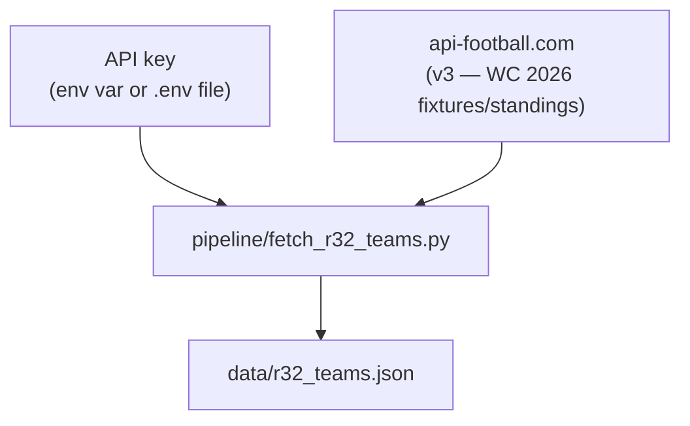

# r32_teams.json — build pipeline

**Update cadence: one-off. This file is effectively static for the duration of WC 2026.**



## When to regenerate

The Round of 32 teams are determined once during the tournament group stage. The file
was populated at that point and does not need to be refreshed again — the 32 qualified
teams do not change.

There is no scheduled job for this file. Re-run manually only if the data is found to
be incorrect:

```bash
export API_FOOTBALL_KEY=your_key_here
python3 pipeline/fetch_r32_teams.py
```

Requires a paid API key from [dashboard.api-football.com](https://dashboard.api-football.com)
(or via RapidAPI).
