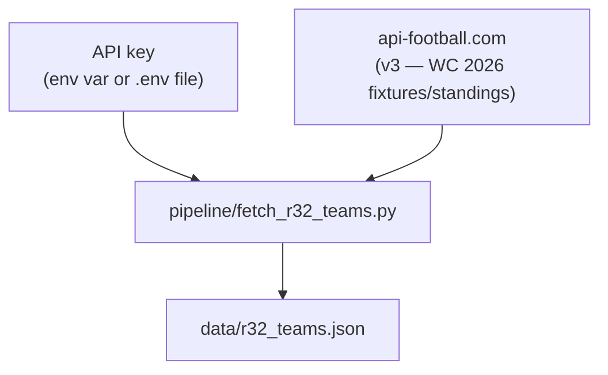

# r32_teams.json — build pipeline

Requires a paid API key from [dashboard.api-football.com](https://dashboard.api-football.com)
(or via RapidAPI). The script is only re-run when the Round of 32 qualification is
decided — it is not part of the regular data refresh cycle.
