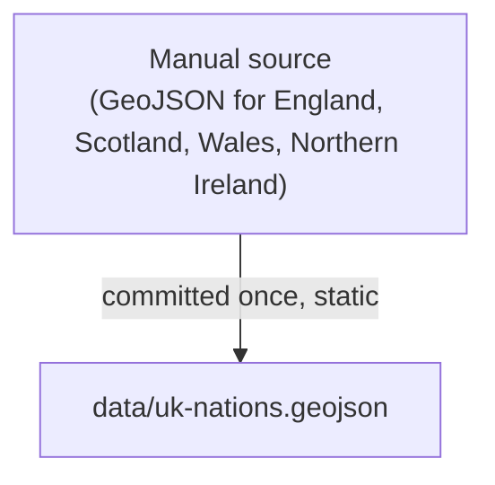

# uk-nations.geojson — origin

`uk-nations.geojson` is a **static file** — it has no pipeline script and is not
regenerated automatically. It was committed once in the initial data import.

The four UK home nations use synthetic IDs (8260–8263) and subdivision alpha2 codes
(`gb-eng`, `gb-sct`, `gb-wls`, `gb-nir`) because they are absent from standard
ISO 3166-1 tables. Their population and capital data are injected into
`pipeline/countries.json` by `pipeline/patch_uk_nations.py`, but the geometry
lives here permanently.
